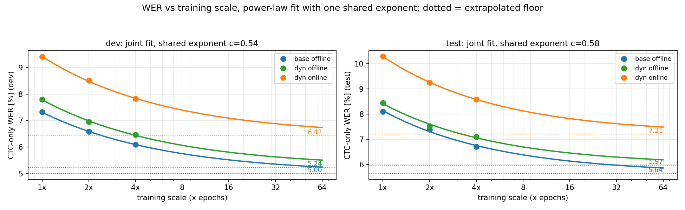

# Chunked CTC / Conformer streaming ASR: results

Code: `i6_experiments/users/zeyer/experiments/exp2025_10_21_chunked_ctc.py`.
This file is generated by `exp2025_10_21_chunked_ctc_summary.py`; edit the template there, not this file.

## Overview / setup

Study: how close chunked streaming attention gets to the offline model.

Task: Loquacious, `large` subset (~25 kh).
1x training = `total_k_hours=100` = 4 full epochs (100 subepochs, split 25).

Model: Conformer encoder + AED (Transformer) decoder, with CTC aux heads.
- encoder: 16 layers, dim 1024, 8 heads, relu-square FF (no bias),
  `ConformerConvSubsample` /6 downsampling (`out_dims=[32,64,64]`).
- decoder: `TransformerDecoder`, 6 layers, dim 1024, RMSNorm, `FeedForwardGated`, rotary causal self-att.
- CTC aux: encoder layers `[4,10,16]`, decoder layer `[3]`; `feature_batch_norm`.

Train: bf16, batch 100k, weight_decay 1e-2, lrlin OCLR base_lr 0.5, max input 19.5 s.
Vocab: spm10k (sampling BPE, breadth_prob 0.01).

Recog:
- CTC-only (`ctc_model_recog`) = headline.
- AED+CTC time-sync (`aed_ctc_timesync_recog_recomb_auto_scale`).
- CTC+LM label-sync + prior (`ctc_recog_recomb_labelwise_prior_auto_scale`),
  LM = Trafo n32-d1024 spm10k.
Encoders: `nn_rf/encoder/chunked_conformer_v1`, `nn_rf/encoder/chunked_conformer_v2.py`.

Eval: Loquacious dev / test, aggregate + per-domain (voxpopuli, commonvoice, librispeech, yodas).
Metric below: CTC-only WER [%], dev / test aggregate, last epoch.

## Baselines

Offline (full-context) reference:

| model | dev | test |
| --- | --- | --- |
| base (offline conformer) | 7.32 | 8.10 |

Vocab size (chunked L80-C5-R4, v1; CTC-only dev):

| vocab | dev |
| --- | --- |
| spm1k | 10.66 |
| spm5k | 9.52 |
| spm10k | 9.56 |

Default: spm10k.

## Comparisons

Each section states the question it answers and lists the runs that answer it.
All numbers are CTC-only WER, dev / test, last epoch.
`h` is `train_time_hours`.

### Chunk geometry: history, center, lookahead

How much left history, center chunk and right lookahead does a chunked model need?
The early sweep used the v1 encoder; most of these runs are retired, the numbers stay here.

History, at C20-R15:

| history | dev / test |
| --- | --- |
| L0 | 10.81 / 11.64 |
| L20 | 8.14 / 8.89 |
| L40 | 8.10 / 8.60 |
| L60 | 7.99 / 8.58 |
| L80 | 7.94 / 8.56 |
| L160 | 7.91 / 8.49 |

History matters most from 0 to 40 and then plateaus.
Repeated at the tight C5-R4 geometry with the v2.3 encoder, where the L0 case is far more extreme:
L0 24.12 / 25.00,
L40 9.41 / 10.35,
L80 9.46 / 10.29.

Center and lookahead, at L40:

| geometry | dev / test |
| --- | --- |
| C5-R30 | 8.08 / 8.71 |
| C10-R25 | 8.05 / 8.77 |
| C10-R30 | 8.03 / 8.67 |
| C20-R20 | 7.95 / 8.43 |
| C40-R15 | 7.77 / 8.40 |
| C40-R0 | 8.64 / 9.27 |

Dropping the lookahead (C40-R0) is the one clear loss, and history does not buy it back:
at C40-R0, L40 8.64,
L80 8.65,
L120 8.62.
That is the first sign that lookahead, not history, is what the model leans on.

Extremes: a tiny chunk is bad (12.59 / 13.05 at C2-R3),
and a very loose chunk approaches offline
(7.36 / 8.08 at C100-R15) but at useless latency.
Middle point for reference: C10-R8 8.68 / 9.28.

### Implementation version and cost knobs

Not a WER question but a correctness and throughput one:
does the rewritten chunked encoder reproduce v1, and what do the options cost?
v1 and v2.2 used a wrong chunking implementation, fixed from `version=3`.

| variant | dev / test | h |
| --- | --- | --- |
| v1 | 9.56 / 10.30 | 215.6 |
| v2.1 (bugged) | 11.74 / 12.49 | 104.5 |
| v2.2 (bugged) | 11.67 / 12.37 | 104.1 |
| v2.3 | 9.46 / 10.29 | 168.8 |
| v2.3, no short-seq adapt | 9.45 / 10.27 | 168.9 |
| v2.3 + grad checkpointing | 9.52 / 10.42 | 201.1 |

v2.3 matches v1 while training faster.
The short-sequence adaptation is WER-neutral.
Grad checkpointing is WER-neutral too and trades time for memory.

### Positional encoding

Relative position vs RoPE vs learnable relative position,
run in both the fixed and the dynamic setting, with an offline control
to separate "helps under chunking" from "helps in general".

| setting | relpos | rope | learnable relpos |
| --- | --- | --- | --- |
| offline | 7.32 / 8.10 | 7.35 / 8.22 | |
| fixed chunk | 9.46 / 10.29 | 9.31 / 10.16 | |
| dynamic chunk, +ctembed | 9.65 / 10.44 | 9.41 / 10.29 | 9.99 / 10.87 |

RoPE is neutral offline and helps under chunking; learnable relpos is the worst of the three.
Why RoPE helps only under chunking was never resolved, and the investigation was stopped deliberately.

### Chunk-type embedding

Does tagging each frame as center or lookahead by its in-chunk position help?
The comparison only makes sense against whether the geometry varies during training,
so it is run in both settings with everything else held constant.

| setting | without ctembed | with ctembed |
| --- | --- | --- |
| fixed chunk, rope | 9.31 / 10.16 | 9.38 / 10.05 |
| dynamic chunk, rope | 9.55 / 10.30 | 9.41 / 10.29 |

It pays off only when the chunk geometry varies during training, and slightly hurts at fixed geometry.

### Fixed vs dynamic chunking

Sampling the chunk geometry per batch costs some WER but buys one model for all recog chunk sizes,
and trains much faster, since a fixed small chunk means many chunks per sequence.

| features | fixed | h | dynamic | h |
| --- | --- | --- | --- | --- |
| plain | 9.46 / 10.29 | 168.8 | 9.66 / 10.39 | 103.9 |
| + rope | 9.31 / 10.16 | 237.1 | 9.55 / 10.30 | 128.4 |

### Dynamic train-pool composition

Given dynamic chunking, what should the pools contain?
Pools are chunk_size / history / lookahead; rope and ctembed are held fixed.

| pool variant | pools | dev / test |
| --- | --- | --- |
| dyn | [5,10,20,40,None] / [80,40] / [4,2] | 9.41 / 10.29 |
| dynCx3 | oversample C=5 | 9.47 / 10.28 |
| dynV4 | + 0 in lookahead | 9.65 / 10.42 |
| dynV3 | + 0 in history too | 10.49 / 11.15 |
| dynV2 | + offline oversampled | 11.00 / 11.85 |

Every zero added to a pool costs WER, and oversampling the deployment chunk buys nothing.
The plain pool is the best of the five.

### Generalization across recog-time chunk size

Sweeping the chunk size and lookahead of a trained checkpoint at recog time,
with controls that never saw varying geometry during training.

Dynamic model:

| recog geometry | dev / test |
| --- | --- |
| C5-R2 | 10.14 / 11.04 |
| C5-R4 (deployment) | 9.41 / 10.29 |
| C10-R4 | 9.00 / 9.82 |
| C20-R4 | 8.61 / 9.32 |
| C40-R4 | 8.26 / 8.94 |
| offline | 7.80 / 8.44 |

A clean monotone curve, and the offline end is what the scaling section uses.
The fixed-chunk controls degrade off-canonical and collapse at offline recog:
rope 10.41 / 12.31,
rope-ctembed 11.32 / 13.40.

The complementary control loads the offline-trained base into the chunked encoder,
verified bit-exact at `chunk_size=None`, then chunks it at recog time only:

| recog geometry | dev / test |
| --- | --- |
| offline | 7.32 / 8.10 |
| C20-R15 | 9.02 / 9.76 |
| C10-R8 | 11.87 / 12.72 |
| C5-R4 | 24.74 / 24.91 |

So chunk-aware training, not just chunk-aware inference, is what matters.

### Overlapping chunks

Overlapping the chunks and averaging the views helps on its own,
but it doubles the compute, so the control is a plain run at twice the budget.

| variant | dev / test | h |
| --- | --- | --- |
| plain v2.3 | 9.46 / 10.29 | 168.8 |
| + overlap | 9.26 / 10.05 | 391.4 |
| + overlap + MSE | 9.27 / 10.08 | 391.8 |
| 2x budget, no overlap | 12.19 / 12.72 | 339.1 |

The 2x control is the one run in this doc whose last epoch must not be read:
its top CTC head diverged at epoch 200, so the comparable value is its best epoch 190,
8.89 / 9.50.
Read that way it matches overlap for the same compute, so overlap's gain is bought by compute,
not by overlap.
On top of the stronger dyn-rope-ctembed base it regresses outright:

| variant | dev / test |
| --- | --- |
| no overlap | 9.41 / 10.29 |
| overlap | 10.42 / 11.22 |
| overlap + MSE | 10.10 / 10.92 |
| overlap dynamic | 9.83 / 10.63 |
| overlap dynamic + ctembedfix | 9.76 / 10.63 |
| overlap dynamic, no ctembed | 10.55 / 11.47 |

Two further questions closed this line.
Turning overlap on at recog only, for a model never trained with it, hurts badly:
C5-R4 10.65 / 11.50,
C5-R2 18.10 / 19.25.
And overlap does not remove the need for lookahead:
overlap at R0 gives 12.82 / 13.38.

### Offline init vs from scratch, at matched budget

Is it better to warm-start the streaming model from the offline one, or train it from scratch?
`impBase` initializes from the 1x base and finetunes for 1x, so 100 + 100 matches the 2x controls.

| variant | dev / test |
| --- | --- |
| from scratch, 1x | 9.41 / 10.29 |
| impBase, finetune LR 0.1 | 9.03 / 9.90 |
| impBase, finetune LR 0.25 | 8.83 / 9.69 |
| impBase, finetune LR 0.5 | 8.84 / 9.71 |
| from scratch, 2x | 8.52 / 9.25 |

Warm-starting beats 1x from scratch but loses to 2x from scratch,
so at equal compute the streaming model is better trained from scratch.

### Encoder architecture: attention vs linear-attention recurrence

Can a recurrent layer carry long context more cheaply than chunked attention?
Eight standard chunked conformer layers interleaved with eight recurrent ones,
outer chunk structure held fixed so the comparison is direct.

| encoder | dev / test | h |
| --- | --- | --- |
| conformer (dyn-rope-ctembed) | 9.41 / 10.29 | 128.3 |
| + Mamba-2 | 10.52 / 11.49 | 174.0 |
| + Mamba-2, bidirectional | 10.74 / 11.52 | 291.5 |
| + DeltaNet | 11.09 / 11.95 | 164.3 |
| + DeltaNet, bidirectional | 11.41 / 12.28 | 197.9 |

All worse than the conformer, Mamba-2 the best of the set,
and going bidirectional hurts both, which was the opposite of the expectation.

### Context extremes

What the chunk is worth, bracketed from both sides.

| model | dev / test |
| --- | --- |
| offline, full context | 7.32 / 8.10 |
| chunked C5-R4 | 9.41 / 10.29 |
| fully causal, unlimited history, no lookahead | 13.76 / 14.65 |
| chunked C5-R4, no history | 24.12 / 25.00 |
| feed-forward encoder, 12 layers | 62.35 / 63.62 |
| feed-forward encoder, 6 layers | 63.88 / 65.26 |

The fully-causal model has unlimited left context and still loses badly to the chunked one,
so the small lookahead does work that history cannot replace.
The feed-forward rows are the zero-context floor, a sanity bound rather than a competitor.

### Streaming inference correctness

An equivalence check, not a WER comparison: does the KV-cache streaming encoder,
which carries state across 10 s segments, match batched chunked inference?

Encoder log-probs on 3 sequences:
max abs diff 2.0e-04,
mean abs diff 1.8e-06.

End-to-end WER, same checkpoint:
streaming 9.42 / 10.29
vs batched chunked 9.41 / 10.29.

### Long-form vs segmented

Does a streaming model degrade on full-length recordings?
TEDLium, streaming-KV recog, on the dyn-rope-ctembed model only.

| eval set | WER |
| --- | --- |
| segmented (leaderboard) | 5.12 |
| segmented, restricted to the long-form talks | 4.88 |
| long-form (11 full talks) | 4.97 |

The filtered row is the honest comparison, since its references are word-for-word identical to long-form.
Segmented is level with or slightly better than long-form on the same content,
and the raw segmented gap is just the extra talk the long-form set omits.
Only one model has been run here, so this is not yet a cross-model comparison.

## Training scale

CTC-only WER, dev / test, last epoch.
base: offline recog.
dyn-rope-ctembed: streaming recog at the deployment chunk (C5, R4).
The `inf` row is not measured: it is the extrapolated floor of the fit below,
and is far less certain than the measured rows.

| scale | base (offline) | dyn-rope-ctembed (streaming) |
| --- | --- | --- |
| 1x | 7.32 / 8.10 | 9.41 / 10.29 |
| 2x | 6.58 / 7.39 | 8.52 / 9.25 |
| 4x | 6.10 / 6.70 | 7.82 / 8.59 |
| inf (fit) | 5.00 / 5.64 | 6.42 / 7.21 |

## Extrapolation to infinite training scale

Decoding the same streaming checkpoint at `chunk_size=None`, which its train pool includes,
splits the streaming cost into two parts:
the price of training under a chunk pool, and the price of decoding in chunks.

| scale | base offline | dyn offline | dyn online |
| --- | --- | --- | --- |
| 1x | 7.32 / 8.10 | 7.80 / 8.44 | 9.41 / 10.29 |
| 2x | 6.58 / 7.39 | 6.96 / 7.53 | 8.52 / 9.25 |
| 4x | 6.10 / 6.70 | 6.46 / 7.10 | 7.82 / 8.59 |
| inf (fit) | 5.00 / 5.64 | 5.24 / 5.97 | 6.42 / 7.21 |

Fit `W(s) = E + b * s^-c` per curve.
Fitted alone that is 3 parameters on 3 points, so the floor E is unidentifiable,
and the floors come out unordered: the streaming floor sinks below its own offline floor,
which inference cannot do.
Sharing one exponent c across all three curves keeps E and b per curve,
giving 7 parameters on 9 points, and the ordering holds.
Result: dev c=0.54 (rms 0.019 abs), test c=0.58 (rms 0.046 abs).
